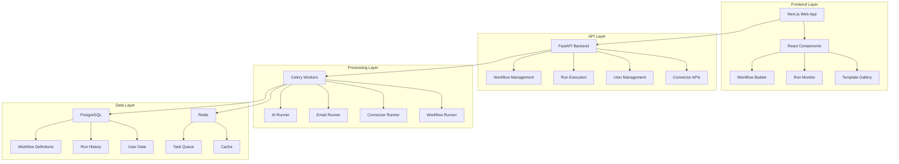

# 🚀 Relay Clone

> **AI-Powered Workflow Automation Platform**

[](https://python.org)
[](https://nodejs.org)
[](https://fastapi.tiangolo.com)
[](https://nextjs.org)
[](https://docker.com)
[](https://kubernetes.io)

Relay Clone is a modern, production-ready workflow automation platform that enables you to build, deploy, and scale AI-powered workflows with enterprise-grade reliability.

## ✨ Features

### 🎯 **Core Capabilities**
- **Visual Workflow Builder**: Drag-and-drop interface for creating complex workflows
- **AI Integration**: Native support for OpenAI GPT and Anthropic Claude models
- **Multi-Channel Execution**: Email, LinkedIn, webhooks, and custom connectors
- **Real-time Monitoring**: Live execution tracking with detailed step-by-step logs
- **Template Gallery**: Pre-built workflow templates for common use cases

### 🏗️ **Technical Features**
- **Modern Stack**: Python FastAPI + Next.js + PostgreSQL + Redis
- **Scalable Architecture**: Kubernetes-ready with auto-scaling capabilities
- **Background Processing**: Celery-powered task queue with retry logic
- **API-First Design**: RESTful APIs with automatic OpenAPI documentation
- **Multi-Deployment**: Docker Compose for development, Kubernetes for production

## 🏗️ Architecture



## 🚀 Quick Start

### Prerequisites

- **Docker** and **Docker Compose**
- **Node.js** 18+ (for local development)
- **Python** 3.11+ (for local development)

### 1. Clone and Setup

```bash
# Clone the repository
git clone https://github.com/your-username/Agent.algorythmos.git
cd Agent.algorythmos

# Copy environment template
cp env.python.example .env

# Edit .env with your API keys
# Required: OPENAI_API_KEY, ANTHROPIC_API_KEY, SMTP_* variables
```

### 2. Start with Docker Compose

```bash
# Quick start (recommended)
./start-python.sh

# Or manually
docker-compose up -d
```

### 3. Access the Application

- **Frontend**: http://localhost:3000
- **API**: http://localhost:8000
- **API Documentation**: http://localhost:8000/docs

## 📖 Documentation

### 📚 **Getting Started**
- [Installation Guide](docs/installation.md)
- [Configuration Guide](docs/configuration.md)
- [First Workflow Tutorial](docs/tutorials/first-workflow.md)

### 🏗️ **Architecture**
- [System Architecture](docs/architecture.md)
- [API Reference](docs/api-reference.md)
- [Database Schema](docs/database-schema.md)

### 🚀 **Deployment**
- [Docker Compose Deployment](docs/deployment/docker-compose.md)
- [Kubernetes Deployment](KUBERNETES_DEPLOYMENT.md)
- [Production Checklist](docs/deployment/production.md)

### 🔧 **Development**
- [Development Setup](CONTRIBUTING.md)
- [Code Style Guide](docs/development/code-style.md)
- [Testing Guide](docs/development/testing.md)

### 📊 **Operations**
- [Monitoring Guide](docs/operations/monitoring.md)
- [Troubleshooting](docs/operations/troubleshooting.md)
- [Performance Tuning](docs/operations/performance.md)

## 🛠️ Tech Stack

### **Frontend**
- **Framework**: Next.js 14 with App Router
- **Language**: TypeScript
- **Styling**: Tailwind CSS
- **State Management**: Zustand
- **UI Components**: React Flow, Lucide Icons

### **Backend**
- **Framework**: FastAPI (Python)
- **Language**: Python 3.11+
- **ORM**: SQLAlchemy
- **Database**: PostgreSQL 15
- **API Documentation**: OpenAPI/Swagger

### **Worker**
- **Framework**: Celery (Python)
- **Broker**: Redis 7
- **Scheduler**: Celery Beat
- **Task Runners**: AI, Email, Connector runners

### **Infrastructure**
- **Containerization**: Docker
- **Orchestration**: Kubernetes + Helm
- **CI/CD**: GitHub Actions (coming soon)
- **Monitoring**: Prometheus + Grafana (coming soon)

## 🔌 Integrations

### **AI Providers**
- **OpenAI**: GPT-3.5, GPT-4 models
- **Anthropic**: Claude models
- **Custom**: Extensible for other providers

### **Communication Channels**
- **Email**: SMTP with HTML/plain text support
- **LinkedIn**: API integration for posts and profiles
- **Webhooks**: Custom HTTP endpoints
- **Slack**: Team notifications (coming soon)

### **Data Sources**
- **Databases**: PostgreSQL, MySQL, MongoDB
- **APIs**: REST and GraphQL endpoints
- **Files**: CSV, JSON, XML processing
- **Cloud Storage**: AWS S3, Google Cloud Storage

## 📊 Workflow Types

### **AI-Powered Workflows**
```yaml
# Example: Content Generation Workflow
steps:
  - type: AI
    config:
      provider: openai
      model: gpt-4
      prompt: "Generate a blog post about {{topic}}"
  - type: EMAIL
    config:
      to: ["editor@company.com"]
      subject: "New Blog Post: {{ai_response.title}}"
      body: "{{ai_response.content}}"
```

### **Data Processing Workflows**
```yaml
# Example: Lead Processing Workflow
steps:
  - type: CONNECTOR
    config:
      type: linkedin
      action: get_profile
      profile_id: "{{lead.linkedin_id}}"
  - type: AI
    config:
      prompt: "Analyze this LinkedIn profile: {{connector_response}}"
  - type: EMAIL
    config:
      to: ["sales@company.com"]
      subject: "Lead Analysis: {{lead.name}}"
```

### **Scheduled Workflows**
```yaml
# Example: Weekly Report Workflow
schedule: "0 9 * * 1"  # Every Monday at 9 AM
steps:
  - type: AI
    config:
      prompt: "Generate weekly sales report"
  - type: EMAIL
    config:
      to: ["team@company.com"]
      subject: "Weekly Sales Report"
```

## 🎯 Use Cases

### **Marketing Automation**
- Lead qualification and scoring
- Content generation and distribution
- Social media management
- Email campaign automation

### **Sales Operations**
- Prospect research and analysis
- Follow-up sequence automation
- CRM data enrichment
- Deal pipeline management

### **Customer Success**
- Onboarding workflow automation
- Support ticket routing
- Customer health monitoring
- Renewal process automation

### **Data Operations**
- ETL pipeline automation
- Data quality monitoring
- Report generation and distribution
- API data synchronization

## 🚀 Deployment Options

### **Development (Docker Compose)**
```bash
# Quick local development
./start-python.sh
```
- ✅ Fast setup and iteration
- ✅ Easy debugging
- ✅ Local development

### **Production (Kubernetes)**
```bash
# Production deployment
./k8s/deploy.sh
```
- ✅ High availability
- ✅ Auto-scaling
- ✅ Rolling updates
- ✅ Production monitoring

## 📈 Performance

### **Benchmarks**
- **Workflow Execution**: < 2 seconds average
- **API Response Time**: < 100ms p95
- **Concurrent Workflows**: 1000+ simultaneous
- **Database Queries**: < 50ms p95

### **Scalability**
- **Horizontal Scaling**: Auto-scaling based on demand
- **Database**: Read replicas and connection pooling
- **Caching**: Redis for session and result caching
- **Load Balancing**: NGINX ingress controller

## 🔒 Security

### **Authentication & Authorization**
- JWT-based authentication
- Role-based access control (RBAC)
- API key management
- OAuth2 integration (coming soon)

### **Data Protection**
- Encryption at rest and in transit
- Secure secret management
- Input validation and sanitization
- Audit logging

### **Infrastructure Security**
- Network policies
- Pod security policies
- Regular security updates
- Vulnerability scanning

## 🤝 Contributing

We welcome contributions! Please see our [Contributing Guide](CONTRIBUTING.md) for details.

### **Quick Contribution**
1. Fork the repository
2. Create a feature branch
3. Make your changes
4. Add tests
5. Submit a pull request

### **Areas for Contribution**
- 🐛 Bug fixes
- ✨ New features
- 📚 Documentation
- 🧪 Tests
- 🔧 Performance improvements

## 📊 Roadmap

### **Q1 2024**
- [ ] Enhanced workflow builder
- [ ] More AI providers
- [ ] Advanced scheduling
- [ ] Team collaboration features

### **Q2 2024**
- [ ] Workflow marketplace
- [ ] Advanced analytics
- [ ] Mobile app
- [ ] Enterprise SSO

### **Q3 2024**
- [ ] Multi-tenant architecture
- [ ] Advanced security features
- [ ] Performance optimizations
- [ ] API rate limiting

## 📞 Support

### **Community**
- **GitHub Discussions**: [Ask questions](https://github.com/your-username/Agent.algorythmos/discussions)
- **GitHub Issues**: [Report bugs](https://github.com/your-username/Agent.algorythmos/issues)
- **Discord**: [Join our community](https://discord.gg/your-server)

### **Enterprise Support**
- **Email**: support@your-domain.com
- **Documentation**: [Enterprise Guide](docs/enterprise.md)
- **Custom Development**: Available upon request

## 📄 License

This project is licensed under the MIT License - see the [LICENSE](LICENSE) file for details.

## 🙏 Acknowledgments

- **OpenAI** for GPT models
- **Anthropic** for Claude models
- **FastAPI** team for the excellent framework
- **Next.js** team for the React framework
- **Celery** team for the task queue
- **All contributors** who make this project possible

---

<div align="center">

**⭐ Star this repository if you find it helpful!**

[🚀 Get Started](docs/installation.md) • [📖 Documentation](docs/) • [🤝 Contributing](CONTRIBUTING.md) • [💬 Community](https://github.com/your-username/Agent.algorythmos/discussions)

</div>